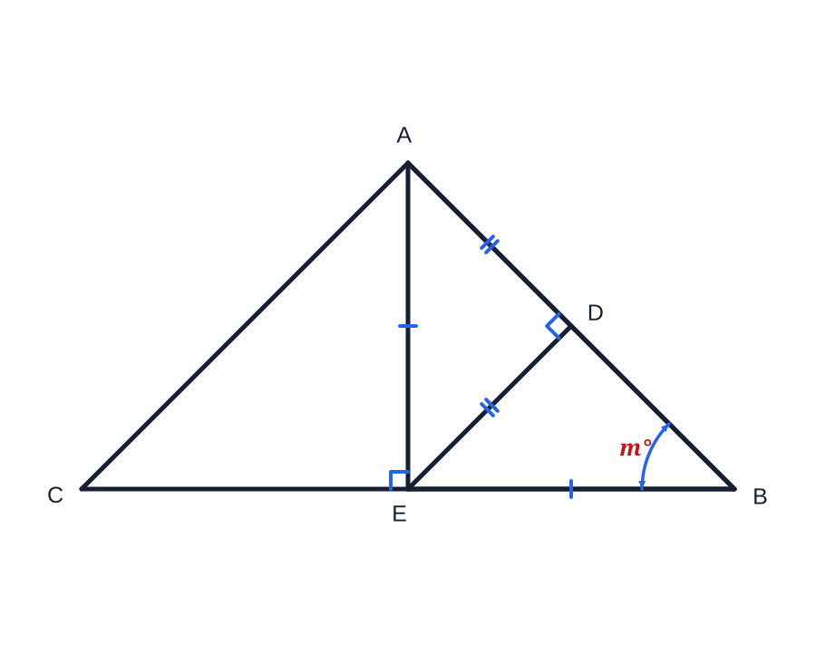

# Python CAD Drawer (Constraint CAD)

`constraint_cad` is a small declarative 2D sketch solver for educational geometry diagrams. Users name points and segments, add geometric relations and driving dimensions, and let the program calculate model coordinates and SVG layout.

It also includes a sanitizer-safe `Drawing` layer for non-geometric educational illustrations such as counters, pictograms, rulers, repeated objects, and simple scene diagrams.

The constraint solver calculates coordinates from geometric relations. The illustration layer uses explicit drawing coordinates. This is a Python library that produces SVG files, rather than an interactive desktop CAD application.

## Installation

Requires Python 3.11 or newer. NumPy is the only runtime dependency and is installed automatically.

From this repository folder:

```bash
python -m venv .venv
source .venv/bin/activate
python -m pip install .
```

On Windows, activate the environment with `.venv\Scripts\Activate.ps1` in PowerShell instead. For development, use `python -m pip install -e .`.

## Try the examples

```bash
python examples/complex_relations.py
python examples/illustration.py
```

Open the generated SVG files in `examples/` with a web browser or vector graphics editor.



## Geometry quick start

```python
from constraint_cad import Sketch

s = Sketch().points("A", "B", "C", "D", "E")
s.segment("AB", "A", "B")
s.segment("CB", "C", "B")
s.segment("AE", "A", "E")
s.segment("EB", "E", "B")
s.segment("ED", "E", "D")
s.segment("guide", "A", "C", construction=True)

s.horizontal("CB")
s.midpoint("E", "CB")
s.vertical("AE")
s.equal("AE", "EB")
s.point_on_line("D", "AB")
s.perpendicular("ED", "AB")
s.length("CB", 10)
s.orientation("A", above="CB")
s.dimension_angle("AB", "CB", "m°", vertex="B")

solution = s.solve()
s.render_svg("output.svg", solution=solution)
```

## Implemented relations

- horizontal and vertical;
- collinear;
- coincident and merge points;
- midpoint and intersection;
- point on line;
- parallel and perpendicular;
- equal segment length;
- symmetric points about a line;
- fixed points;
- driving segment lengths;
- driving angles between named lines or rays;
- above, below, left, and right branch hints.

## Drawing and annotation tools

- `segment(..., construction=True)` uses a line in the solver but hides it in the finished SVG;
- `dimension_angle(...)` automatically finds the vertex, ends its curve exactly on both selected rays, adds compact arrowheads, and positions its label;
- `mark_equal(...)` and `mark_parallel(...)` show conventional relation marks without adding redundant solver equations;
- equal, parallel, and perpendicular solver relations generate their relation marks automatically;
- `render_svg(...)` fits the solved sketch to the requested canvas and can independently hide point labels or relation marks;
- all SVG styling is emitted as safe presentation attributes, with no embedded CSS, `<style>` element, or label background box.

## Illustration layer

Use `Drawing` when an assessment image is pictorial rather than a constraint-solved geometry construction.

```python
from constraint_cad import Drawing

pen = Drawing(60, 24, background=None)
pen.rect(0, 7, 42, 10, radius=4, fill="#5cc8ff", stroke="#172033", stroke_width=2)
pen.polygon([(42, 7), (58, 12), (42, 17)], fill="#f3c178", stroke="#172033", stroke_width=2)

page = Drawing(420, 100)
for x in (20, 90, 160, 230, 300):
    page.use(pen, (x, 30), rotate=-18)
page.render_svg("pens.svg", title="A row of pens")
```

Implemented illustration primitives:

- lines, rectangles, circles, ellipses, polygons, polylines, and SVG paths;
- sampled function plots clipped to a coordinate window;
- text labels, regular stars, arrows, clocks, grids, and isometric cubes;
- reusable glyph drawings with translation, scale, rotation, and opacity;
- inline presentation attributes only, with reusable glyphs expanded locally instead of external references.

## Solver behaviour

- Coordinates are solved simultaneously with damped Gauss–Newton iterations.
- Translation, rotation, and scale gauges are added internally when the sketch leaves them free.
- The result reports convergence, maximum relation error, redundant equations, and remaining shape degrees of freedom.
- Conflicting dimensions or relations raise `ConstraintError`.
- SVG output is automatically fitted and uses inline presentation attributes suitable for embedding in educational content.

## Tests

After installation, run from this repository folder:

```bash
python -m unittest discover -s tests -v
```

GitHub Actions runs these tests on Python 3.11, 3.12, and 3.13.

## Publish to GitHub

Create an empty GitHub repository, then run these commands inside this folder (replace `YOUR-USERNAME` and the repository name with your own):

```bash
git init
git add .
git commit -m "Initial Python CAD Drawer release"
git branch -M main
git remote add origin https://github.com/YOUR-USERNAME/python-cad-drawer.git
git push -u origin main
```

This folder is self-contained: no files from the surrounding learning materials are required.

## License

No license has been selected. Add a `LICENSE` file if you want to grant others permission to reuse or distribute this code.
